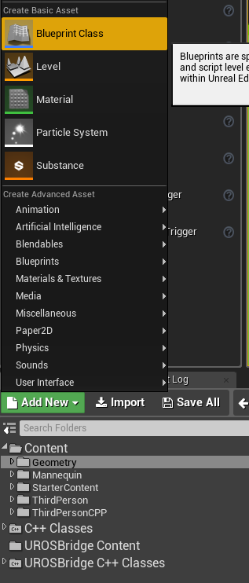
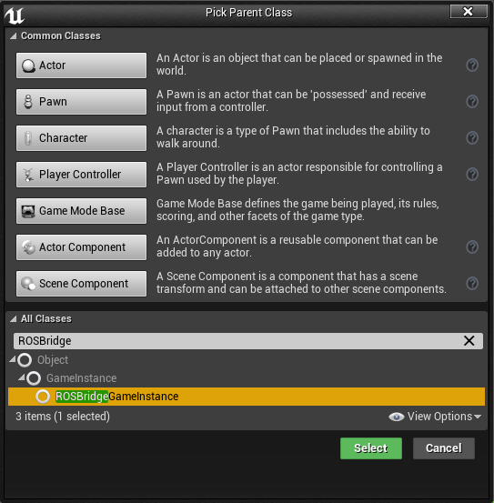
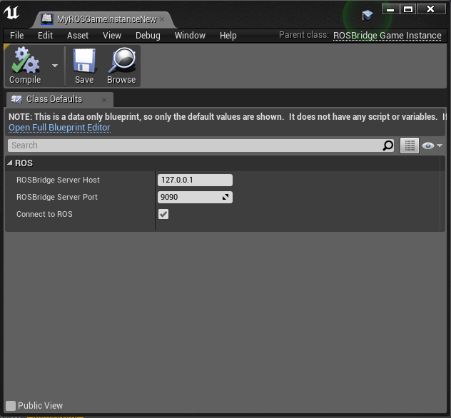

### Hold a single UROSBridge Handler in a custom Game Instance

UROSBridge needs a single instance of ROSBridgeHandler to take care of all ROS communication.
In order to keep this in a central place, it's good practice to keep this instance in a custom GameInstance class.
This acts as a Singleton and can be accessed by all Actors in your environment to interact with ROS.
A benefit of this Game Instance is also that it can be configured from within your UE4Editor,
so you don't need to put your connection parameters into your code.

#### Configuration
- Install UROSBridge as usual
- Add a new Blueprint to your Project:


- Let it derive from ROSBridgeGameInstance to get the basic handler logic and parameter handling:

- Open your newly created Blueprint and set the connection parameters for UROSBridge:

- **Set your new game instance in your project settings: Edit -> Project Settings -> Maps & Modes -> Game Instance Class**

#### Usage
As an example, we'll set up the game instance and create an Actor that publishes something on /talker on every Tick():

- Create an AActor in your Project
- Add a Publisher and the corresponding to the Header File of your AActor:
```cpp
#include "ROSBridgePublisher.h"

.....
protected:
  TSharedPtr<FROSBridgePublisher> Publisher;
```
- Add the Header file of the ROSBridgeGameInstance class and declare a publisher:

```cpp
#include "ROSBridgeGameInstance.h"

....

void AExampleActor::BeginPlay() {
	Super::BeginPlay();

	// Accessing the Game Instance and checking for nullptr
	check(GetGameInstance());

	// Getting the actual UROSBridgeGameInstance 
	UROSBridgeGameInstance* ActiveGameInstance = Cast<UROSBridgeGameInstance>(GetGameInstance());
	check(ActiveGameInstance);

	check(ActiveGameInstance->ROSHandler.IsValid());

	Publisher = MakeShareable<FROSBridgePublisher>(new FROSBridgePublisher(TEXT("/talker"), TEXT("std_msgs/String")));
	ActiveGameInstance->ROSHandler->AddPublisher(Publisher);

	ActiveGameInstance->ROSHandler->Process();
}

void AExampleActor::Tick(float DeltaTime) {
	Super::Tick(DeltaTime);

	TSharedPtr<std_msgs::String> StringMsgPtr(new std_msgs::String(TEXT("Test String")));

	UROSBridgeGameInstance* ActiveGameInstance = Cast<UROSBridgeGameInstance>(GetGameInstance());
	check(ActiveGameInstance);
	ActiveGameInstance->ROSHandler->PublishMsg("/talker", StringMsgPtr);
}
```


### 사용자 지정 게임 인스턴스에서 단일 UROSBridge 핸들러를 유지합니다.

UROSBridge는 모든 ROS 통신을 처리하기 위해 ROSBridgeHandler의 단일 인스턴스가 필요합니다.
이것을 중앙 위치에 유지하려면 이 인스턴스를 사용자 지정 GameInstance 클래스에 유지하는 것이 좋습니다.
이것은 싱글톤으로 작동하며 ROS와 상호 작용하기 위해 환경의 모든 액터가 액세스할 수 있습니다.
이 게임 인스턴스의 장점은 UE4Editor 내에서 구성할 수 있다는 것입니다.
따라서 연결 매개변수를 코드에 넣을 필요가 없습니다.

#### 구성
- 평소와 같이 UROSBridge 설치
- 프로젝트에 새 청사진 추가:


- ROSBridgeGameInstance에서 파생되어 기본 처리기 논리 및 매개변수 처리를 가져옵니다.

- 새로 생성된 Blueprint를 열고 UROSBridge에 대한 연결 매개변수를 설정합니다.

- **프로젝트 설정에서 새 게임 인스턴스 설정: 편집 -> 프로젝트 설정 -> 맵 및 모드 -> 게임 인스턴스 클래스**

#### 용법
예를 들어, 게임 인스턴스를 설정하고 모든 Tick()에서 /talker에 무언가를 게시하는 Actor를 만들 것입니다.

- 프로젝트에 AActor 생성
- AActor의 헤더 파일에 해당하는 게시자 및 해당 추가:
```cpp
#include "ROSBridgePublisher.h"

.....
보호:
  TSharedPtr<FROSBridgePublisher> 게시자;
```
- ROSBridgeGameInstance 클래스의 헤더 파일을 추가하고 게시자를 선언합니다.

```cpp
#include "ROSBridgeGameInstance.h"

....

무효 AExampleActor::BeginPlay() {
슈퍼::BeginPlay();

// 게임 인스턴스에 접근하여 nullptr 확인
체크(GetGameInstance());

// 실제 UROSBridgeGameInstance 가져오기
UROSBridgeGameInstance* ActiveGameInstance = Cast<UROSBridgeGameInstance>(GetGameInstance());
체크(액티브 게임 인스턴스);

체크(ActiveGameInstance->ROSHandler.IsValid());

게시자 = MakeShareable<FROSBridgePublisher>(new FROSBridgePublisher(TEXT("/talker"), TEXT("std_msgs/String")));
ActiveGameInstance->ROSHandler->AddPublisher(게시자);

ActiveGameInstance->ROSHandler->Process();
}

무효 AExampleActor::Tick(float DeltaTime) {
슈퍼::Tick(DeltaTime);

TSharedPtr<std_msgs::String> StringMsgPtr(new std_msgs::String(TEXT("테스트 문자열")));

UROSBridgeGameInstance* ActiveGameInstance = Cast<UROSBridgeGameInstance>(GetGameInstance());
체크(액티브 게임 인스턴스);
ActiveGameInstance->ROSHandler->PublishMsg("/talker", StringMsgPtr);
}
```